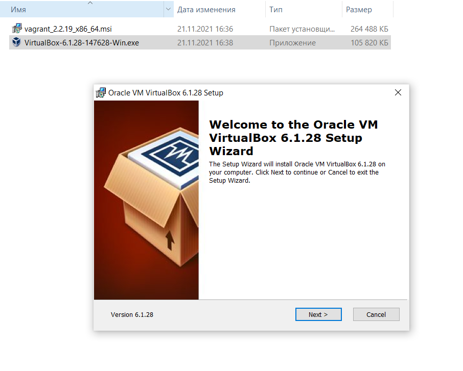
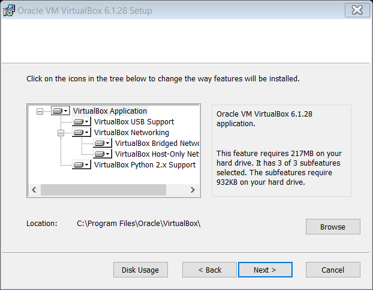
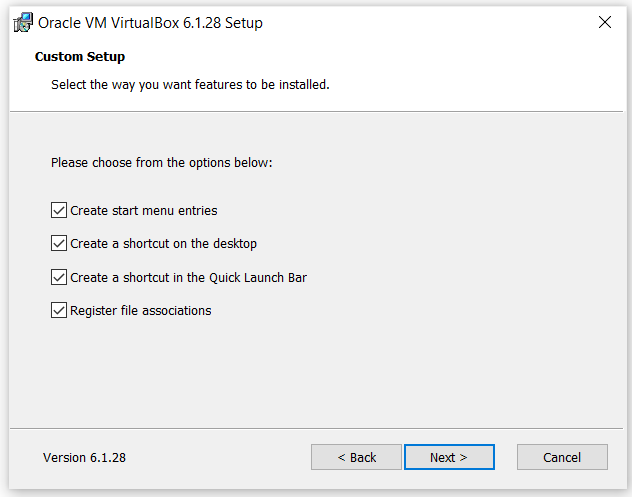
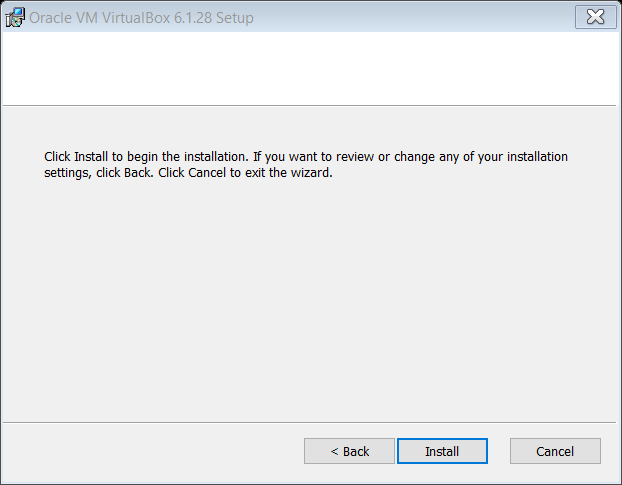
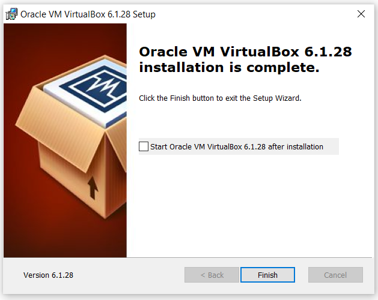
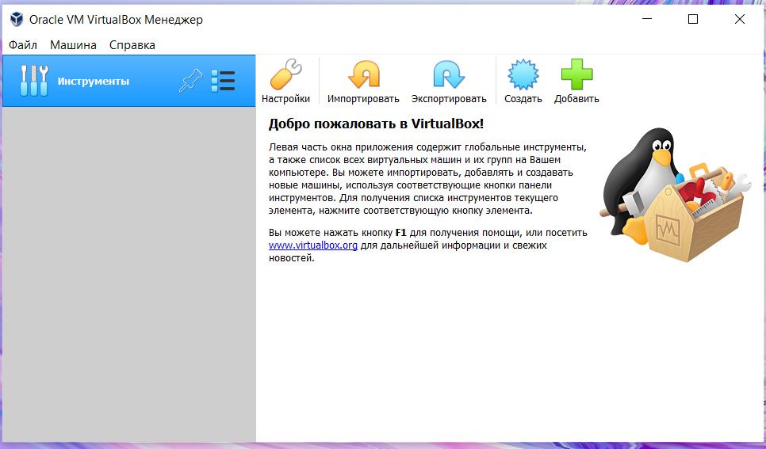
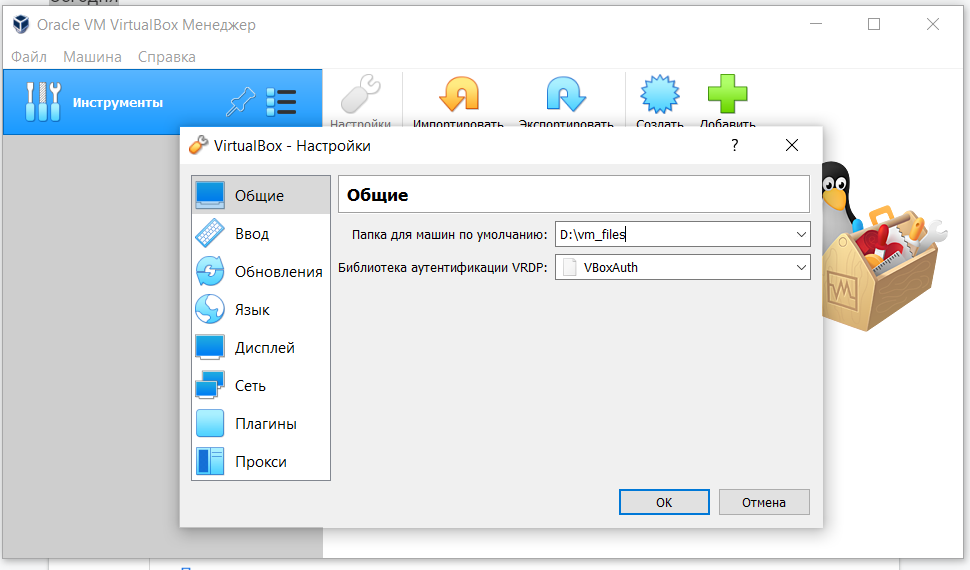

### Урок 1 Установка и настройка Linux
#### Расссматриваемые вопросы.

    1. Установка и настройка Oracle Virtual Box
    2. Установка Linux из iso образа в  ВМ под управлением Oracle Virtual Box
    3. Основная настройка Linux
    4. Установка и настройка Vagrant 
    5. Работа Vagrant + Oracle Virtual Box для быстрого создания стендов c ВМ

##### Установка и настройка Oracle Virtual Box

##### Установка Linux из iso образа в  ВМ под управлением Oracle Virtual Box

##### Основная настройка Linux

##### Установка и настройка Vagrant 

##### Работа Vagrant + Oracle Virtual Box для быстрого создания стендов c ВМ
