### Урок 1 Установка и настройка Linux
#### Расссматриваемые вопросы.

    1. Установка и настройка Oracle Virtual Box 
    2. Установка и настройка Astra Linux CE из iso образа в  ВМ под управлением Oracle Virtual Box
    3. Установка и настройка Vagrant 
    4. Работа Vagrant + Oracle Virtual Box для быстрого создания стендов c ВМ

### Установка и настройка Oracle Virtual Box
Шаг 1.

Шаг 2.

Шаг 3.

Шаг 4.

Шаг 5.

Шаг 6.

При первом входе желательно задать местонахождение файлов ВМ, чтобы потом с ними было проще работать.

Для выволняем в основном меню: Файл -> настройки. После чего откровется окно в котором заем местонахождение файлов ВМ:  

### Установка и настройка Linux из iso образа в  ВМ под управлением Oracle Virtual Box

Скачать iso Astra Linux CE можно c - https://download.astralinux.ru/astra/stable/orel/iso/

#### Создание пустой ВМ для установки Astra Linux CE.

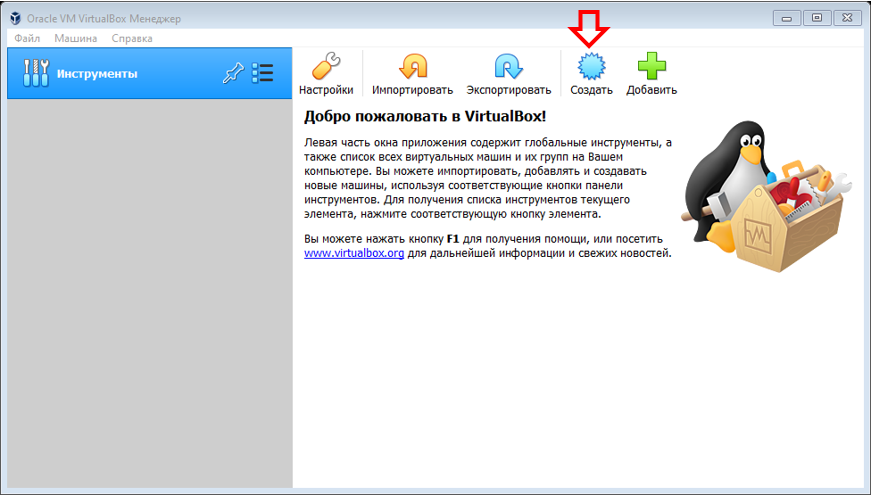

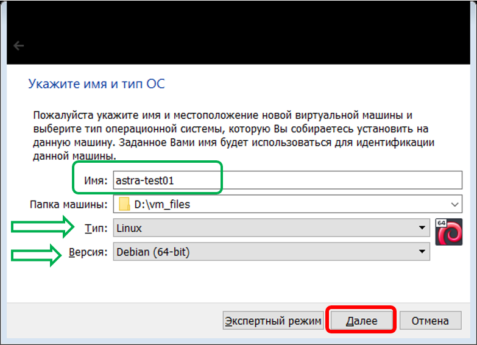

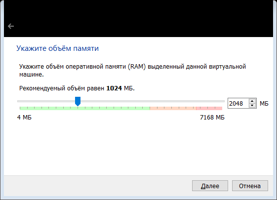

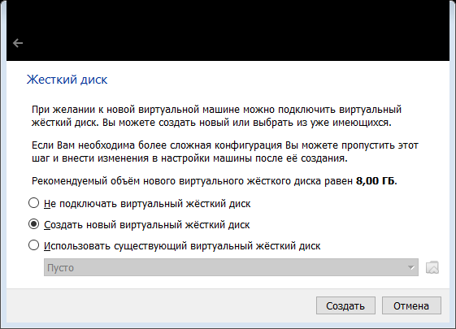

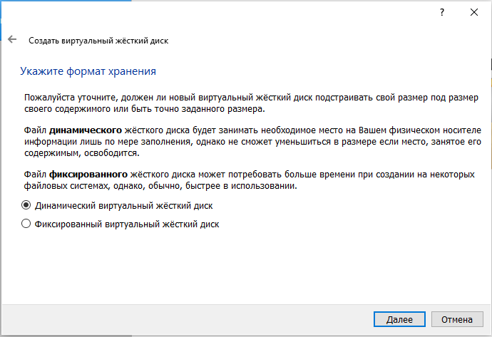

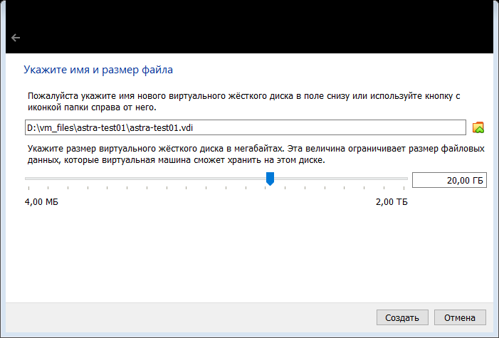

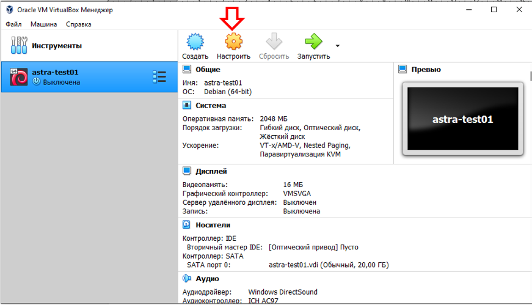

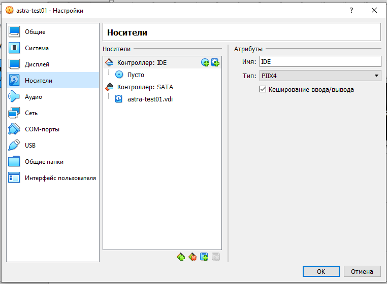

#### Установка Astra Linux 

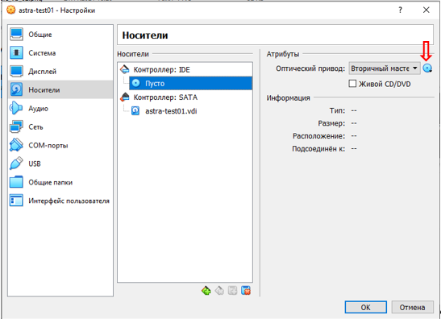

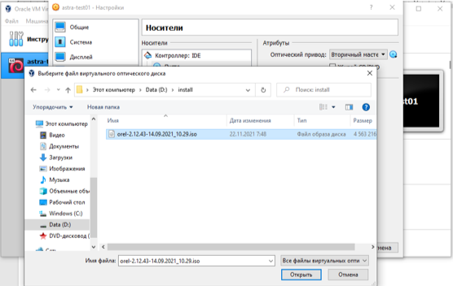

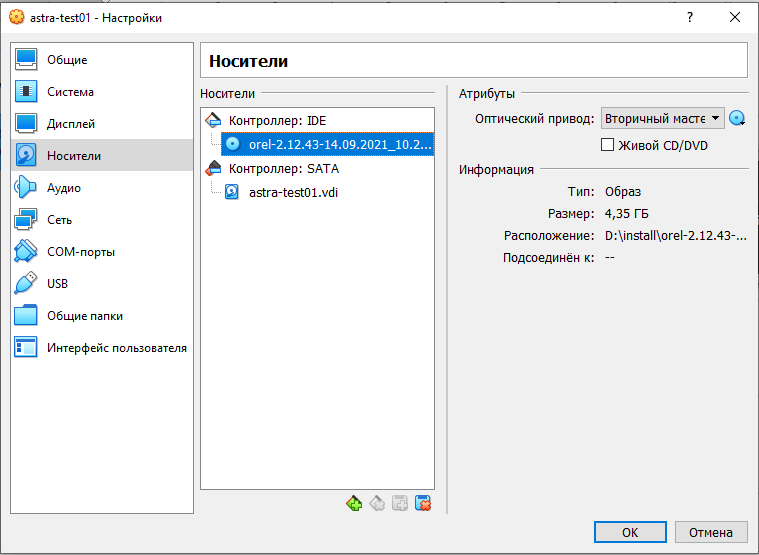

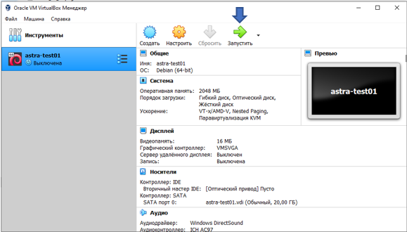

Установка описана в документе - https://astralinux.ru/products/astra-linux-common-edition/documents-astra-ce/instrukcziya-po-ustanovke-os-astra-linux-common-edition.pdf стр 13.

### Установка и настройка Vagrant 
Шаг 1.

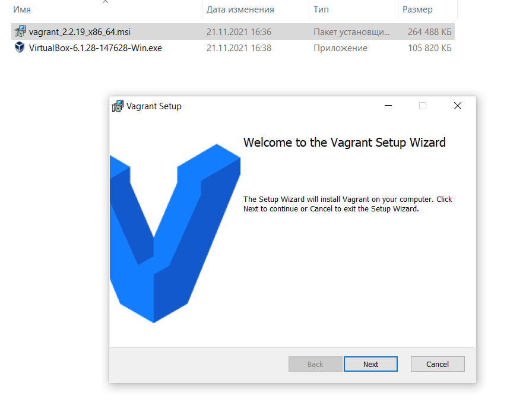

Шаг 2.

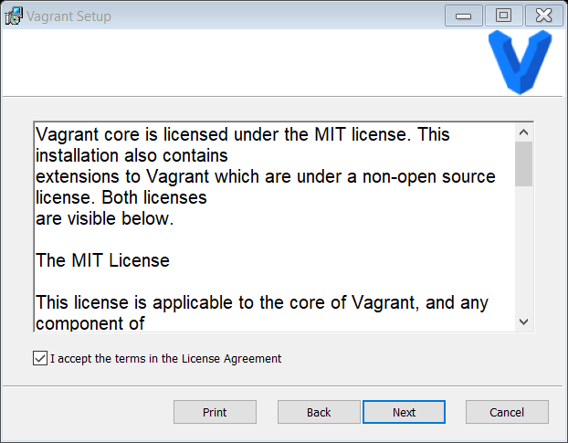

Шаг 3.

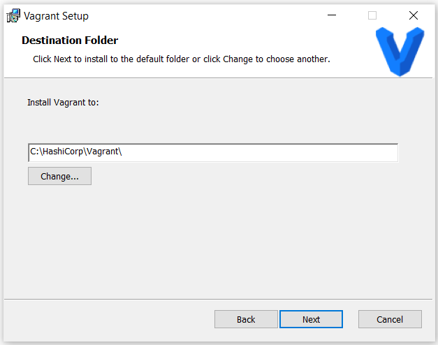

Шаг 4.

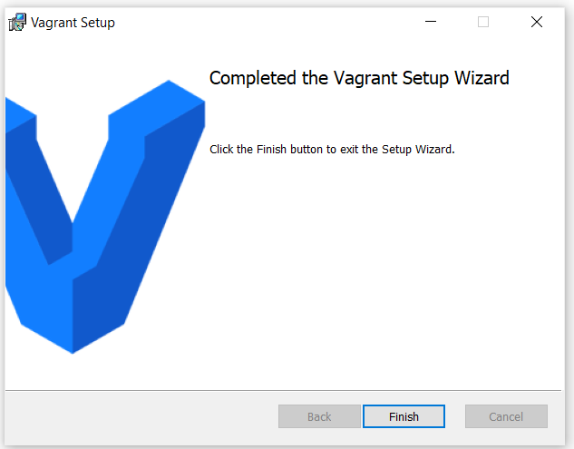

Шаг 5.

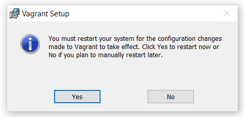

После установки vagrant и перезагрузки ПК выполняем проверку установленной версии .

        vagrant version

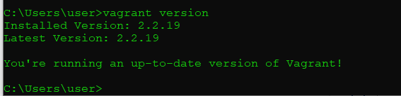

Выводим функциональные возможности vagrant по созданию и управлению ВM
    
    vagrant --help
    
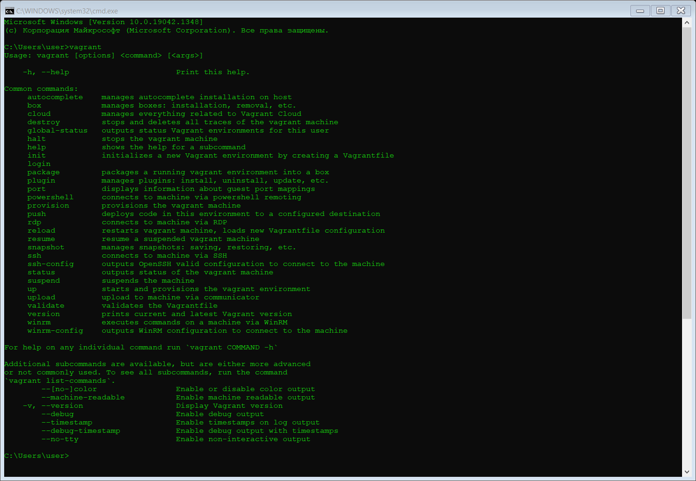

Для нормальной работы дополнительного функционала используемого в конфигурационных файлах Vagrantfile необходимо установить plugin vagrant-vbguest

Для этого выполняем команду.
        
        vagrant plugin install vagrant-vbguest

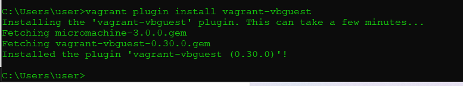

### Работа Vagrant + Oracle Virtual Box для быстрого создания стендов c ВМ.

В основы работы Vagrant погружаться не будем. О этом можно прочитать на сайте https://www.vagrantup.com/

Для проверения первого этапа обучения подготовлены 2 Vagrantfile c Astra Linux CE.

1. Vagrantfile_gui - файл позволяющий развернуть ВМ c графическим интерфейсом

https://github.com/Aleksey-10081967/Education/blob/main/lesson-1/vagrant-files/Vagrantfile_gui

2. Vagrantfile_gui - файл позволяющий развернуть ВМ c графическим интерфейсом

https://github.com/Aleksey-10081967/Education/blob/main/lesson-1/vagrant-files/Vagrantfile_nogui

Порядок действий следующий.

Шаг 1.

На ПК создается каталог в котором будет лежать Vagrantfile + создаться служебный каталог .vagrant для работы ВМ развернытых с помощью Vagrant.
(Например С:\vagrant\Astra_GUI\)

Шаг 2. 
В созданный каталог копируем файл Vagrantfile_gui и желательного переименовываем его в Vagrantfile

Шаг 3.
Запускаем cmd и переходим в каталог СС:\vagrant\Astra_GUI\

    cd С:\vagrant\Astra_GUI\
    
Шаг 4.
Выполняем команду создания ВМ с помощью vagrant
    
    vagrant up

Основные параменты создаваемой ВМ:

        Имя - astrace01

        IP - 192.168.56.2

        box - "rta/orelgui"

После первого запуска в начале vagrant загрует box file c ОС Asta c сайта - https://app.vagrantup.com/boxes/search

Это может занять значительное время. Проверить выполнение загрузки можно через Диспетчер задач - Производительность

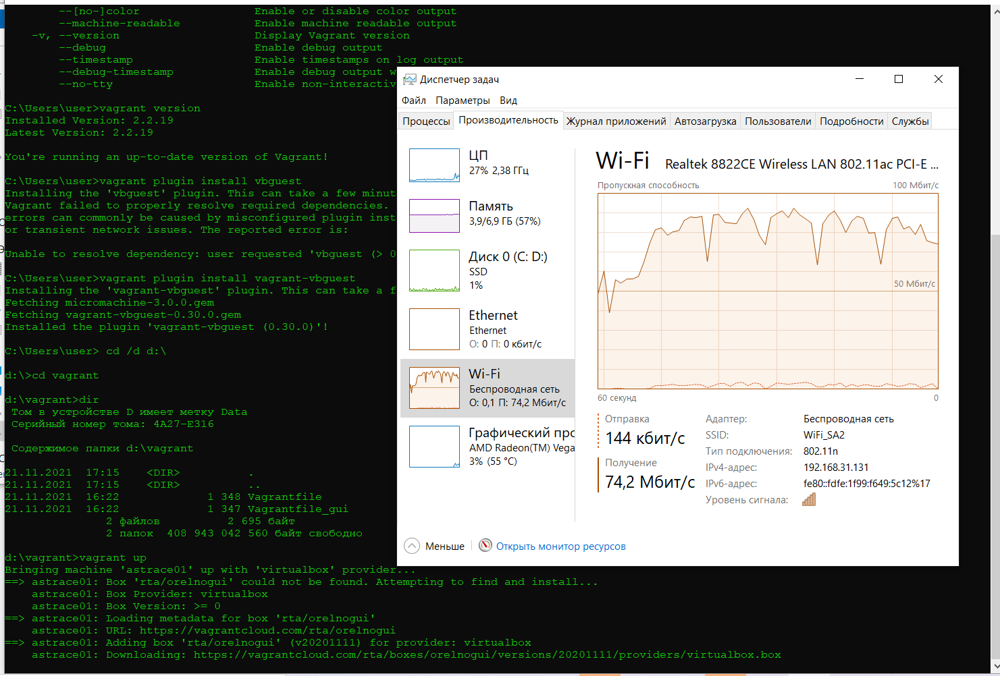

Ниже показан скрин-шот завершения создания ВМ. Если появились ошибки надо разбираться.

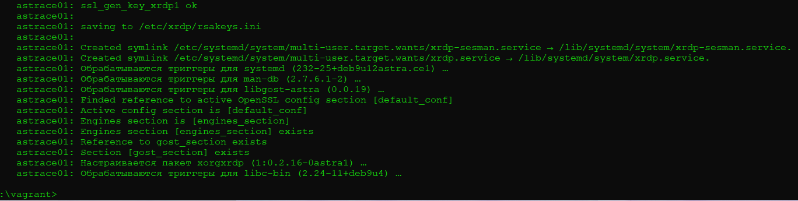

После успешного создания ВМ можно к ней подключиться по ssh.
    
    vagrant ssh
    
Подключение выполняется под пользователем:
vagrant / vagrant

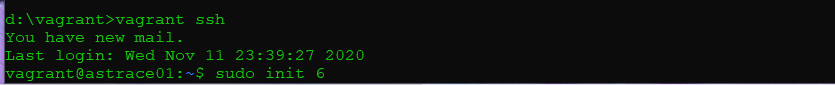

После первого подключения по ssh к ВМ настоятельно рекомендую сделать reboot BM.
    
    sudo init 6

После перезагрузки ВМ можно подключиться через GUI

Для этого через иконку на рабочем столе 

Открыть интерфейс Oracle Virtual Box

B двойным щелчком мыши открыть графический вход в ВМ.

Пользователь входа: vagrant password:vagrant

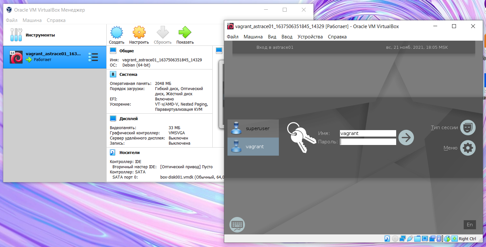

При развертывании ВМ дополнительно создается пользователь: 
superuser / Superuser54321

Дополнительно при развертывании ВМ устанавливается сервис xpd который позволяет с Windows подключаться к ВМ по RDP

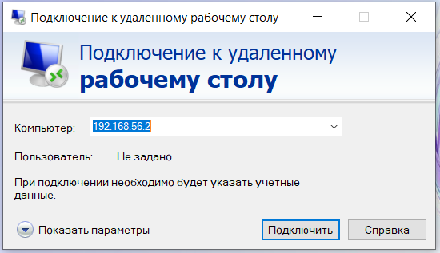

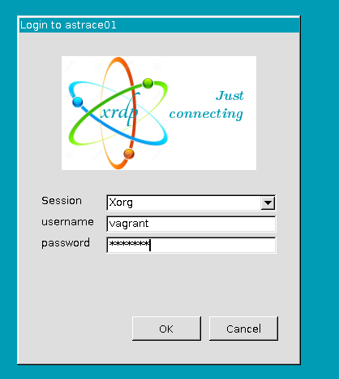

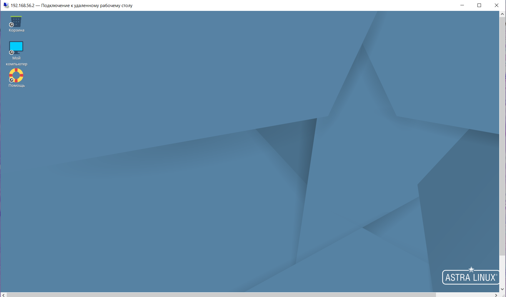

