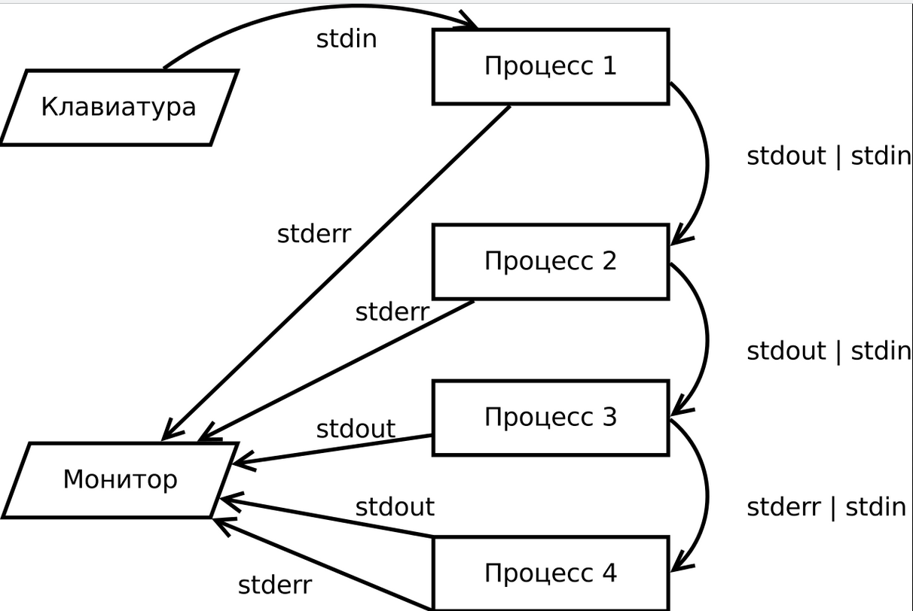
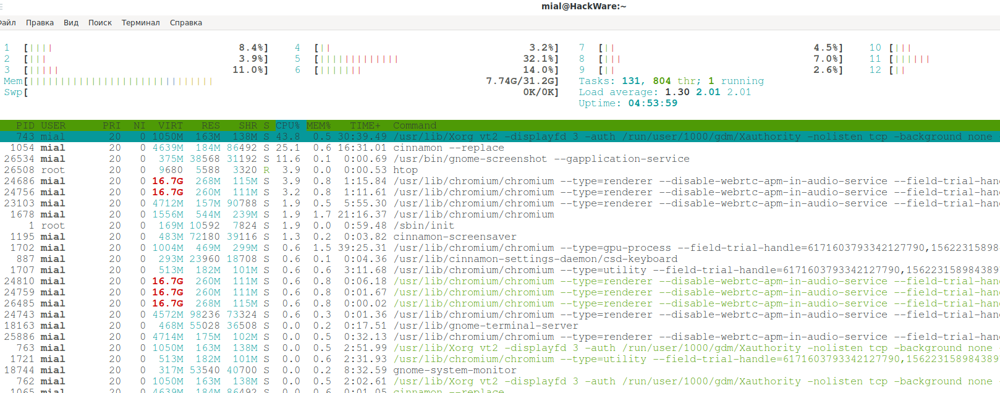

##  Пакетные менеджеры, стандартные потоки ввода - вывода,конвейер, загрузка ОС, Systemd, процессы 

### Пакетные менеджеры

Пакетный менеджер — это набор утилит для установки, удаления, обновления, поиска пакетов в Linux, а также для управления репозиториями.

APT - открытый консольный менеджер пакетов для дистрибутивов Linux,основанных на пакетах формата DEB (Debian, Ubuntu, Kbuntu, Astra Linux и др)

YUM - открытый консольный менеджер пакетов для дистрибутивов Linux, основанных на пакетах формата RPM (RedHat, CentOS, Fedora, Oracle Linux). 

Пакетный менеджер APT - основные команды.

      list - показать список пакетов из указанных имён пакетов
      search - искать в описаниях пакетов
      show - показать дополнительные данные о пакете
      install - установить пакеты
      remove - удалить пакеты
      autoremove - автоматически удалить все неиспользуемые пакеты
      update - обновить список доступных пакетов
      upgrade - обновить систему, устанавливая/обновляя пакеты
      full-upgrade - обновить систему, удаляя/устанавливая/обновляя пакеты
      edit-sources - редактировать файл с источниками пакетов

Настрйка репозиториев для скачивания пакетов определяется в файле /etc/apt/sources.list
Пример ниже.

        deb https://download.astralinux.ru/astra/stable/orel/repository/ orel main contrib non-free
        #deb http://mirror.yandex.ru/astra/stable/orel/repository/ orel main contrib non-free

В данном примере приведена запись о стандартном репозитории AStra Linux CE,имя ядра - orel, ветка - main, местонахождение - https://download.astralinux.ru/astra/stable/orel/repository/

Также на ВМ или сервере есть доп каталог /etc/apt/sources.list.d в который размещаются файлы с описанием отдельных репозиторием которые поддерживают разработчики ПО.
Например:

        root@pc-asarafanov-01:/etc/apt/sources.list.d# ls -al
        итого 24
        drwxr-xr-x 2 root root 4096 ноя  2 09:23 .
        drwxr-xr-x 6 root root 4096 ноя 28 11:00 ..
        -rw-r--r-- 1 root root  189 ноя  2 09:23 google-chrome.list
        -rw-r--r-- 1 root root  188 сен 19 18:55 opera-stable.list
        -rw-r--r-- 1 root root   63 мар 14  2021 pgdg.list
        -rw-r--r-- 1 root root  193 апр 25  2021 slack.list

        less google-chrome.list
        deb [arch=amd64] http://dl.google.com/linux/chrome/deb/ stable main

[Основные команды менеджера yum](https://github.com/Aleksey-10081967/Education/tree/main/lesson-3/dop_files/manage_repo.md)

### Стандартные потоки ввода - вывода, конвeйр

Процесс взаимодействия с пользователем выполняется в терминах записи и чтения в файл. То есть вывод на экран представляется как запись в файл, а ввод — как чтение файла. Файл, из которого осуществляется чтение, называется стандартным потоком ввода, а в который осуществляется запись — стандартным потоком вывода. 

Стандартные потоки — воображаемые файлы, позволяющие осуществлять взаимодействие с пользователем как чтение и запись в файл. Кроме потоков ввода и вывода, существует еще и стандартный поток ошибок, на который выводятся все сообщения об ошибках и те информативные сообщения о ходе работы программы, которые не могут быть выведены в стандартный поток вывода.

Стандартные потоки привязаны к файловым дескрипторам с номерами 0, 1 и 2.

    Стандартный поток ввода (stdin) — 0;
    Стандартный поток вывода (stdout) — 1;
    Стандартный поток ошибок (stderr) — 2. 

Перенаправление стандартного потока вывода

Обычно команды выводят данные в стандартный поток вывода. Для того, чтобы эти данные оказались в файле, нужно добавить символ > после команды, перед именем целевого файла. До и после > надо поставить пробел. При этом в данный файл будут перенаправлен  поток вывода (1)

        top -bn 5 > top.log 
        или
         top -bn 5 1>top.log  - явно указав дескриптор файла вывода

При использовании перенаправления любой файл, указанный после > будет перезаписан

При >> данные будут дописаны в файл

        traceroute 8.8.8.8  >> top.log

Для того чтобы перенаправить поток ошибок в файл необходимо выполнить:
 
        ls -l /root/ 2 > ls-error.log

После выполнения команды смотрим что в файле ls-error.log.
        less ls-error.log
        ls: невозможно открыть каталог '/root/': Отказано в доступе

Чтобы добавить данные в конец файла используйте >>:

           ls -l /root/ 2 >> ls-error.log

Можно перенаправить весь вывод, ошибки и стандартный поток вывода в один файл:

        ls -l /root/ >ls-error.log 2>&1
        или
        ls -l /root/ &> ls-error.log
        

Используя знак < вместо > мы можем перенаправить стандартный ввод, заменив его содержимым файла.
        
        cat < top.log

Конвейер (англ. pipeline) — некоторое множество процессов, для которых выполнено следующее перенаправление ввода-вывода: то, что выводит на поток стандартного вывода предыдущий процесс, попадает в поток стандартного ввода следующего процесса.

         ls -lt | head -n 5

Использование /dev/null

Пример команды:

      grep -r hello /sys/

Имеем при выполнении данной команды под обычным пользователем выдается сообщение - Отказано в доступе.

      grep: /sys/kernel/slab/:a-0000256/reclaim_account: Отказано в доступе
      grep: /sys/kernel/slab/:a-0000256/order: Отказано в доступе
      grep: /sys/kernel/slab/:a-0000256/object_size: Отказано в доступе
      grep: /sys/kernel/slab/:a-0000256/shrink: Отказано в доступе
      grep: /sys/kernel/slab/:a-0000256/hwcache_align: Отказано в доступе
      grep: /sys/kernel/slab/:a-0000256/objs_per_slab: Отказано в доступе
      grep: /sys/kernel/slab/:a-0000256/partial: Отказано в доступе
      grep: /sys/kernel/slab/:a-0000256/slabs_cpu_partial: Отказано в доступе
      grep: /sys/kernel/slab/:a-0000256/ctor: Отказано в доступе
      grep: /sys/kernel/slab/:a-0000256/slab_size: Отказано в доступе
      grep: /sys/kernel/slab/:a-0000256/cache_dma: Отказано в доступе
      grep: /sys/kernel/slab/:0000544/remote_node_defrag_ratio: Отказано в доступе
      grep: /sys/kernel/slab/:0000544/total_objects: Отказано в доступе

Использование перенаправление потока ошибок 2 в /dev/null мы получаем ответ, что таких строк нет.

      grep -r hello /sys/ 2> /dev/null

      asarafanov-adm@pc-asarafanov-01:~$ grep -r hello /sys/ 2> /dev/null
      asarafanov-adm@pc-asarafanov-01:~$ 

В ряде случаев нужно отфильровать поток вывода, а на экран выводить только ошибки:

      ping google.com 1>/dev/null
      
Также можно как поток вывода, так и поток ошибок направть в /dev/null

      grep -r power /sys/ >/dev/null 2>&1

Данная запись говорит что поток вывода направляется в /dev/null, а поток ошибок в поток вывода.

### Загрузка ОС.
Загрузка ОС включает в себя следующие этапы.

1. Включение питания

       Загрузка BIOS/UEFI из NVRAM
       Тест “железа”
       Выбор загрузочного устройства (диск, сеть)

2. Запуск загрузчика

       GRUB
       Выбор в какое ядро грузиться

3. Загрузка ядра
      
       Создание структуры данных ядра
       Старт PID 1 (init/systemd) 

### Systemd

Systemd – это система инициализации и системный менеджер

#### Инициализация процессов

Запускается с PID 1

запускает остальные части системы

параллельно!

В systemd целью большинства действий являются юниты – ресурсы, которыми systemd может управлять. Юниты делятся на категории по типам ресурсов, которые они представляют. Юниты определяются в так называемых юнит-файлах. Тип каждого юнита можно определить по суффиксу в конце файла.

              Тип                  unit’а Описание
              target               ничего не описывает, группирует другие юниты
              service              аналог демона (или то, что можно запустить)
              timer                аналог cron (запуск другого юнита, default - *.service)
              device               факт подключения устройства (sysfs-имя устройства)
              mount                точка монтирования файловой системы
              automount            точка автомонтирования (*.mount)
              socket               запуск юнита при подключении к указанному сокету (default - *.service)
              path                 запуск юнита по событию доступа к пути (default - *.service)
              slice                группирует другие юниты в дереве cgroups
              swap                 управление swap’ом (*.device)
              snapshot             снимки состояния сервисов
              scope                “области” или “границы”, заданные systemd 

Для задач управления сервисами предназначены юнит-файлы с суффиксом .service. Однако в большинстве случаев суффикс .service можно опустить, так как система systemd достаточно умна, чтобы без суффикса определить, что нужно делать при использовании команд управления сервисом.

#### Основные команды управления юнитами на примере - сервисов)

Запуск сервиса, где application имя сервиса. (например - nginx)

      sudo systemctl start nginx.service
       
Остановка сервиса.

      sudo systemctl stop nginx.service
       
Перезапуск сервиса       

      sudo systemctl restart  nginx.service
       
Перезагрузка конфигурационных файлов сервиса

      sudo systemctl reload nginx.service
              
Добавление сервиса в автозагрузку

      sudo systemctl enable nginx.service
       
Удаление сервиса из автозагрузки

       sudo systemctl disable nginx.service

Проверка статуса сервиса

       sudo systemctl status
       
Запрос списка текущих юнитов systemd       

       sudo systemctl list-units

фильтр –type=. Он позволяет отфильтровать юниты по типу

       systemctl list-units --type=service
       
Systemd может блокировать юнит  (автоматически или вручную), создавая симлинк на /dev/null. Это называется маскировкой юнитов и выполняется командой mask.

       sudo systemctl mask nginx.service
       
Теперь сервис Nginx не будет запускаться автоматически или вручную до тех пор, пока включена маскировка.

### Анализ запуска процессов systemd

#### root@pc-asarafanov-01:~# systemd-analyze 

              Startup finished in 4.248s (kernel) + 4.339s (userspace) = 8.588s

#### root@pc-01:~# systemd-analyze critical-chain

The time after the unit is active or started is printed after the "@" character.
The time the unit takes to start is printed after the "+" character.

              graphical.target @4.105s
              └─multi-user.target @4.105s
                └─vboxweb-service.service @4.100s +5ms
                  └─network-online.target @4.099s
                    └─NetworkManager-wait-online.service @889ms +3.209s
                      └─NetworkManager.service @838ms +50ms
                        └─network-pre.target @837ms
                          └─firewalld.service @549ms +288ms
                            └─polkit.service @1.206s +16ms
                              └─basic.target @517ms
                                └─sockets.target @517ms
                                  └─acpid.socket @517ms
                                    └─sysinit.target @515ms
                                      └─systemd-update-utmp.service @512ms +2ms
                                        └─systemd-tmpfiles-setup.service @502ms +9ms
                                          └─local-fs.target @501ms
                                            └─run-user-999.mount @960ms
                                              └─local-fs-pre.target @198ms
                                                └─lvm2-monitor.service @138ms +60ms
                                                  └─lvm2-lvmetad.service @153ms
                                                    └─system.slice @135ms
                                                      └─-.slice @125ms
 #### root@pc-01:~# systemd-analyze blame
 
          3.209s NetworkManager-wait-online.service
           381ms vboxdrv.service
           288ms firewalld.service
           235ms libvirtd.service
           173ms dev-mapper-sarafanov\x2d\x2dgr05\x2dsarafanov\x2d\x2dusr.device
           172ms dev-mapper-sarafanov\x2d\x2dgr01\x2dsarafanov\x2d\x2droot.device
           144ms systemd-fsck@dev-disk-by\x2duuid-2e52f139\x2d20ee\x2d4671\x2d88ee\x2dc808a5f27133.service
           143ms apt-daily.service
           129ms gpm.service
           129ms astra-orientation.service
           126ms systemd-fsck@dev-disk-by\x2duuid-bafe308c\x2dffee\x2d420e\x2da8dd\x2d7ed1eb874f4f.service
            95ms apt-daily-upgrade.service
            87ms mnt-disk\x2dvm.mount
            73ms systemd-sysctl.service
            62ms mnt-disk\x2ddata.mount
            60ms lvm2-monitor.service
            58ms dev-mapper-sarafanov\x2d\x2dgr03\x2dsarafanov\x2d\x2dswap.swap
            57ms keyboard-setup.service
            50ms NetworkManager.service
            48ms quota.service
            46ms ssh.service
            44ms networking.service
            41ms systemd-udev-trigger.service
            39ms dnsmasq.service
            39ms rpcbind.service
            35ms systemd-logind.service
            34ms systemd-udevd.service
            33ms rsyslog.service
            32ms udisks2.service
            30ms systemd-journald.service
            30ms user@999.service
            29ms avahi-daemon.service
            29ms fly-dm.service
            29ms systemd-modules-load.service
            28ms upower.service
            22ms systemd-fsck@dev-disk-by\x2duuid-de1cf4f3\x2d6b96\x2d4d97\x2d997c\x2dfaacf9d83e29.service
            21ms plymouth-quit.service
            21ms plymouth-quit-wait.service
            20ms boot.mount
            20ms systemd-fsck@dev-mapper-sarafanov\x2d\x2dgr07\x2dsarafanov\x2d\x2dtmp.service
            18ms quotarpc.service
            18ms home.mount
            17ms systemd-tmpfiles-setup-dev.service
            16ms systemd-journal-flush.service
            16ms polkit.service
            14ms user@1001.service
            14ms plymouth-start.service
            14ms systemd-fsck@dev-mapper-sarafanov\x2d\x2dgr06\x2dsarafanov\x2d\x2dopt.service
            13ms systemd-fsck@dev-mapper-sarafanov\x2d\x2dgr04\x2dsarafanov\x2d\x2dvar.service
            13ms tmp.mount
            13ms opt.mount
            13ms var.mount
            11ms xrdp.service
            11ms plymouth-read-write.service
            10ms systemd-fsck@dev-mapper-sarafanov\x2d\x2dgr02\x2dsarafanov\x2d\x2dhome.service

### Процессы в Linux

Процесс создается в памяти при запуске программы или команды.

Процессу присваивается уникальный идентификационный номер, известный как идентификатор процесса (PID), который используется ядром для управления процессом до завершения программы или команды, с которой он связан.

В Linux можно выделить 3 типа процессов.

Процессы переднего плана (или «интерактивные процессы») — они инициализируются и управляются с помощью терминального сеанса. Другими словами, необходимым условием для запуска таких процессов является наличие пользователя, подключенного к системе; они не запускаются автоматически как часть системных функций/служб. Когда команда/процесс выполняется на переднем плане, то они полностью занимают запустивший их терминал. Вы не сможете использовать другие команды, т.к. приглашение оболочки будет недоступно, пока данный процесс выполняется на переднем плане.

Фоновые процессы (или «автоматические процессы») — это процессы, не подключенные к терминалу; они не ожидают пользовательского ввода данных. Таким образом, другие процессы могут выполняться параллельно с процессом, запущенным в фоновом режиме, поскольку им не нужно ждать его завершения.

Демоны (англ. «daemons») — это особый тип фоновых процессов, которые запускаются при старте системы и продолжают работать в виде службы; они не умирают. Такие процессы запускаются как системные задачи (службы). Однако при этом они могут управляться пользователем через systemctl.

#### Состояния процесса

После того как процесс порожден, он не работает непрерывно.

Он может некоторое время находиться в нерабочем состоянии или ждать, пока какой-либо другой процесс передаст ему информацию, чтобы он мог продолжить работу.

Существует пять состояний процесса, и каждый процесс в любой момент времени находится в одном из них.

Эти состояния – running, sleeping, waiting, stopped и zobmie.

    Running определяет, что процесс в данный момент выполняется системным процессором.
    
    Sleeping состояние показывает, что процесс в настоящее время ожидает ввода от пользователя или другого процесса.
    
    Waiting означает, что процесс получил входные данные, которых он ждал, и теперь он готов к выполнению, как только придет его очередь.
    
    Stopped означает, что процесс остановлен и не будет выполняться, даже когда придет его очередь, если ему не будет послан сигнал.
    
    Состояние zombie означает, что процесс мертв. Зомби-процесс существует в таблице процессов так же, как и любая другая запись процесса, но не занимает никаких ресурсов. Запись для зомби-процесса сохраняется до тех пор, пока родительский процесс не разрешит ему умереть. Зомби-процесс также называют неработающим процессом.
    
[Основные системные процессы Linux](https://github.com/Aleksey-10081967/Education/tree/main/lesson-3/dop_files/list_sys_process.md)

#### Основные утилиты мониторинга процессов
#### Утилита ps.
ps (processes status — статус процессов) — это встроенная утилита Unix/Linux для просмотра информации, касающейся выбора запущенных процессов в системе: она считывает эту информацию из виртуальных файлов в файловой системе /proc.

root@pc-asarafanov-01:/etc/apt/sources.list.d# ps - Показывает список процессов в данном терминале.

              PID TTY          TIME CMD
            14369 pts/0    00:00:00 sudo
            14370 pts/0    00:00:00 bash
            15601 pts/0    00:00:00 ps

выводе присутствует четыре столбца:

PID: идентификационный номер процесса.
TTY: имя консоли, на которой пользователь выполнил вход.
TIME: количество времени центрального процессора, которое потребил процесс.
CMD: имя команды, которая запустила процесс

ps -e | less  - вывод всех процессов
      
              PID TTY          TIME CMD
          1 ?        00:00:01 systemd
          2 ?        00:00:00 kthreadd
          3 ?        00:00:00 rcu_gp
          4 ?        00:00:00 rcu_par_gp
          6 ?        00:00:00 kworker/0:0H-ev
          7 ?        00:00:03 kworker/0:1-rcu
          9 ?        00:00:00 mm_percpu_wq
         10 ?        00:00:00 rcu_tasks_kthre
         11 ?        00:00:00 rcu_tasks_rude_
         12 ?        00:00:00 rcu_tasks_trace
         13 ?        00:00:00 ksoftirqd/0
         14 ?        00:00:06 rcu_sched
         15 ?        00:00:00 migration/0
         16 ?        00:00:00 idle_inject/0
         17 ?        00:00:00 cpuhp/0
         18 ?        00:00:00 cpuhp/1
         19 ?        00:00:00 idle_inject/1
 

ps -ef | less
     
            UID        PID  PPID  C STIME TTY          TIME CMD
            root         1     0  0 10:55 ?        00:00:01 /sbin/init
            root         2     0  0 10:55 ?        00:00:00 [kthreadd]
            root         3     2  0 10:55 ?        00:00:00 [rcu_gp]
            root         4     2  0 10:55 ?        00:00:00 [rcu_par_gp]
            root         6     2  0 10:55 ?        00:00:00 [kworker/0:0H-ev]
            root         7     2  0 10:55 ?        00:00:03 [kworker/0:1-rcu]
            root         9     2  0 10:55 ?        00:00:00 [mm_percpu_wq]
            root        10     2  0 10:55 ?        00:00:00 [rcu_tasks_kthre]
            root        11     2  0 10:55 ?        00:00:00 [rcu_tasks_rude_]
            root        12     2  0 10:55 ?        00:00:00 [rcu_tasks_trace]
            root        13     2  0 10:55 ?        00:00:00 [ksoftirqd/0]
            root        14     2  0 10:55 ?        00:00:06 [rcu_sched]
            root        15     2  0 10:55 ?        00:00:00 [migration/0]

 Добавлены следующие новые столбцы:

UID: идентификатор пользователя владельца этого процесса.
PPID: идентификатор родительского процесса.
C: Количество детей, которые есть у процесса.
STIME: Время начала. Время, когда процесс был запущен.

      ps aux | less
            USER       PID %CPU %MEM    VSZ   RSS TTY      STAT START   TIME COMMAND
            root         1  0.0  0.0 210436  8300 ?        Ss   10:55   0:01 /sbin/init
            root         2  0.0  0.0      0     0 ?        S    10:55   0:00 [kthreadd]
            root         3  0.0  0.0      0     0 ?        I<   10:55   0:00 [rcu_gp]
            root         4  0.0  0.0      0     0 ?        I<   10:55   0:00 [rcu_par_gp]
            root         6  0.0  0.0      0     0 ?        I<   10:55   0:00 [kworker/0:0H-ev]
            root         7  0.0  0.0      0     0 ?        I    10:55   0:03 [kworker/0:1-rcu]
            root         9  0.0  0.0      0     0 ?        I<   10:55   0:00 [mm_percpu_wq]
            root        10  0.0  0.0      0     0 ?        S    10:55   0:00 [rcu_tasks_kthre]
            root        11  0.0  0.0      0     0 ?        S    10:55   0:00 [rcu_tasks_rude_]
            root        12  0.0  0.0      0     0 ?        S    10:55   0:00 [rcu_tasks_trace]
            root        13  0.0  0.0      0     0 ?        S    10:55   0:00 [ksoftirqd/0]
            root        14  0.0  0.0      0     0 ?        I    10:55   0:06 [rcu_sched]
            root        15  0.0  0.0      0     0 ?        S    10:55   0:00 [migration/0]
            root        16  0.0  0.0      0     0 ?        S    10:55   0:00 [idle_inject/0]
            root        17  0.0  0.0      0     0 ?        S    10:55   0:00 [cpuhp/0]
            root        18  0.0  0.0      0     0 ?        S    10:55   0:00 [cpuhp/1]
            root        19  0.0  0.0      0     0 ?        S    10:55   0:00 [idle_inject/1]
            root        20  0.0  0.0      0     0 ?        S    10:55   0:00 [migration/1]
            root        21  0.0  0.0      0     0 ?        S    10:55   0:00 [ksoftirqd/1]
            root        23  0.0  0.0      0     0 ?        I<   10:55   0:00 [kworker/1:0H-ev]

#### Утилита top

            top - 21:00:27 up 10:04,  2 users,  load average: 0,11, 0,23, 0,24
            Tasks: 334 total,   1 running, 213 sleeping,   0 stopped,   0 zombie
            %Cpu(s):  0,4 us,  0,1 sy,  0,0 ni, 99,6 id,  0,0 wa,  0,0 hi,  0,0 si,  0,0 st
            KiB Mem : 98873696 total, 92728704 free,  3516492 used,  2628508 buff/cache
            KiB Swap: 78123008 total, 78123008 free,        0 used. 94239568 avail Mem 

              PID USER      PR  NI    VIRT    RES    SHR S  %CPU %MEM     TIME+ COMMAND                                                                                                                                                                
             2966 asarafa+  20   0 3477716 450248 146596 S   2,4  0,5  31:13.37 /usr/lib/firefox/firefox -contentproc -childID 5 -isForBrowser -prefsLen 7710 -prefMapSize 238381 -jsInit 285176 -parentBuildID 20210721174149 -appdir /usr/lib/firef+ 
            11860 asarafa+  20   0 3049956 315912 177152 S   1,4  0,3   1:43.13 /usr/lib/firefox/firefox -contentproc -childID 19 -isForBrowser -prefsLen 8853 -prefMapSize 238381 -jsInit 285176 -parentBuildID 20210721174149 -appdir /usr/lib/fire+ 
             2635 asarafa+  20   0 4269548 796440 332596 S   1,0  0,8  36:19.66 /usr/lib/firefox/firefox                                                                                                                                               
             9334 asarafa+  20   0 3065412 267696 139176 S   1,0  0,3   4:46.83 /usr/lib/firefox/firefox -contentproc -childID 11 -isForBrowser -prefsLen 8853 -prefMapSize 238381 -jsInit 285176 -parentBuildID 20210721174149 -appdir /usr/lib/fire+ 
             2735 asarafa+  20   0 3209292 319776 141980 S   0,7  0,3   2:21.15 /usr/lib/firefox/firefox -contentproc -childID 1 -isForBrowser -prefsLen 102 -prefMapSize 238381 -jsInit 285176 -parentBuildID 20210721174149 -appdir /usr/lib/firefo+ 
             2892 asarafa+  20   0 9534028 363884 159200 S   0,7  0,4   2:59.07 /usr/lib/firefox/firefox -contentproc -childID 4 -isForBrowser -prefsLen 5563 -prefMapSize 238381 -jsInit 285176 -parentBuildID 20210721174149 -appdir /usr/lib/firef+ 
             9376 asarafa+  20   0 3257360 402956 146008 S   0,7  0,4   1:58.53 /usr/lib/firefox/firefox -contentproc -childID 12 -isForBrowser -prefsLen 8853 -prefMapSize 238381 -jsInit 285176 -parentBuildID 20210721174149 -appdir /usr/lib/fire+ 
            15776 root      20   0   45508   4020   3228 R   0,7  0,0   0:00.02 top                                                                                                                                                                    
             1269 fly-dm    20   0  468800 149608  88016 S   0,3  0,2   7:57.33 /usr/lib/xorg/Xorg -br -novtswitch -quiet -keeptty :0 vt7 -logfile /var/log/fly-dm/Xorg.%s.log -seat seat0 -auth /var/run/xauth/A:0-khC7ib                             
             2273 asarafa+  20   0 20,671g 137900 101892 S   0,3  0,1   0:16.03 /opt/Mattermost/mattermost-desktop                                                                                                                                     
             5446 asarafa+  20   0 5246540 267176 209520 S   0,3  0,3   0:43.52 /opt/kingsoft/wps-office/office6/wpsoffice /prometheus /home/asarafanov-adm/Desktops/Desktop1/?екции.xlsx                                                         
             9047 asarafa+  20   0  556640  60504  51260 S   0,3  0,1   0:12.72 fly-term                                                                                                                                                               
             9851 asarafa+  20   0 2905792 198848 129828 S   0,3  0,2   0:39.99 /usr/lib/firefox/firefox -contentproc -childID 17 -isForBrowser -prefsLen 8853 -prefMapSize 238381 -jsInit 285176 -parentBuildID 20210721174149 -appdir /usr/lib/fire+ 
            10125 asarafa+  20   0 1267984 575060 236912 S   0,3  0,6   2:37.00 /opt/kingsoft/wps-office/office6/wps /wps /from_prome /prome-pipe-token=kprometheus.5446.5446.2018424845 /prome-prestart-type=0                                        
                1 root      20   0  210436   8300   5976 S   0,0  0,0   0:01.22 /sbin/init 

PID — идентификатор процесса

USERNAME — пользователь, от которого запущен процесс

THR — количество потоков, запущенных процессом

PR — текущий приоритет процесса

NICE — приоритет, выставленный командой nice. От −20 (наивысший) до 19.

SIZE — размер процесса (данные, стек и т. д.) в килобайтах

RES — текущее использование оперативной памяти

STATE — текущее состояние («START», «RUN» (только в этом состоянии показывает текущую нагрузку программы на процессор), «SLEEP», «STOP», «ZOMB», «WAIT» или «LOCK»)

C — номер процессора, на котором идет выполнение (доступен только на SMP системах)

TIME — время использования процессора в секундах

VIRT — полный объем виртуальной памяти, которую занимает процесс

%CPU — процент доступного времени процессора, которое использовала запущенная программа

%MEM — процент использования оперативной памяти данным процессом

WCPU — усредненное значение CPU

COMMAND — команда, запустившая процесс.

#### Утилита htop

