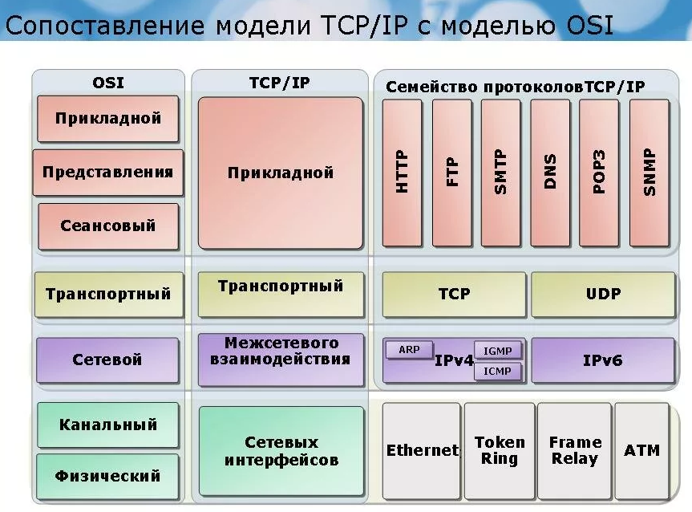

## Основы сетей

### Что такое сеть? 
Сеть - это совокупность устройств и систем, которые подключены друг к другу (логически или физически) и общающихся между собой. 
Сюда можно отнести сервера, компьютеры, телефоны, маршрутизаторы и так далее. 
Размер этой сети может достигать размера Интернета, а может состоять всего из двух устройств, соединенных между собой кабелем. 
В общем выделяется три группы компонентов:

Оконечные узлы: Устройства, которые передают и/или принимают какие-либо данные. Это могут быть компьютеры, телефоны, сервера, какие-то терминалы или тонкие клиенты, телевизоры.

Промежуточные устройства: Это устройства, которые соединяют оконечные узлы между собой. Сюда можно отнести коммутаторы, концентраторы, модемы, маршрутизаторы, точки доступа Wi-Fi.

Сетевые среды: Это те среды, в которых происходит непосредственная передача данных. Сюда относятся кабели, сетевые карточки, различного рода коннекторы, воздушная среда передачи. Если это медный кабель, то передача данных осуществляется при помощи электрических сигналов. У оптоволоконных кабелей, при помощи световых импульсов. Ну и у беспроводных устройств, при помощи радиоволн.

### Для чего мы используем сети (примеры):

1) Приложения: При помощи приложений отправляем разные данные между устройствами, открываем доступ к общим ресурсам. Это могут быть как консольные приложения, так и приложения с графическим интерфейсом.

2) Сетевые ресурсы: Это сетевые принтеры, которыми, к примеру, пользуются в офисе или сетевые камеры, которые просматривает охрана, находясь в удаленно.

3) Хранилище: Используя сервер или рабочую станцию, подключенную к сети, создается хранилище доступное для других. В хранилище хранятся файлы, видео, картинки и открывают общий доступ к ним для других пользователей. 

4) Резервное копирование: Часто, в крупных компаниях, используют центральный сервер, куда все компьютеры копируют важные файлы для резервной копии. Это нужно для последующего восстановления данных, если оригинал удалился или повредился. Методов копирования огромное количество: с предварительным сжатием, кодированием и так далее.

5) VoIP: Телефония, работающая по протоколу IP. Применяется она сейчас повсеместно, так как проще, дешевле традиционной телефонии и с каждым годом вытесняет ее.

### Топология. 
Она делится на 2 большие категории: физическая и логическая. 

Физическая топология — это как наша сеть выглядит. Где находятся узлы, какие сетевые промежуточные устройства используются и где они стоят, какие сетевые кабели используются, как они протянуты и в какой порт воткнуты. 

Логическая топология — это каким путем будут идти пакеты в нашей физической топологии. То есть физическая — это как мы расположили устройства, а логическая — это через какие устройства будут проходить пакеты.

#### Виды топологии:

Топология с общей шиной (англ. Bus Topology)

Кольцевая топология (англ. Ring Topology)

Топология звезда (англ. Star Topology)

Полносвязная топология (англ. Full-Mesh Topology)

Неполносвязная топология (англ. Partial-Mesh Topology)

Смешанная топология (англ. Hybrid Topology)

#### 7 уровневая модель ISO

1) Физический уровень (Physical Layer): определяет метод передачи данных, какая среда используется (передача электрических сигналов, световых импульсов или радиоэфир), уровень напряжения, метод кодирования двоичных сигналов.

2) Канальный уровень (Data Link Layer): он берет на себя задачу адресации в пределах локальной сети, обнаруживает ошибки, проверяет целостность данных. Если слышали про MAC-адреса и протокол «Ethernet», то они располагаются на этом уровне.

3) Сетевой уровень (Network Layer): этот уровень берет на себя объединения участков сети и выбор оптимального пути (т.е. маршрутизация). Каждое сетевое устройство должно иметь уникальный сетевой адрес в сети. На данном уровне работают протоколы IPv4 и IPv6.

4) Транспортный уровень (Transport Layer): Этот уровень берет на себя функцию транспорта. К примеру, когда вы скачиваете файл с Интернета, файл в виде сегментов отправляется на Ваш компьютер. Также здесь вводятся понятия портов, которые нужны для указания назначения к конкретной службе. На этом уровне работают протоколы TCP (с установлением соединения) и UDP (без установления соединения).

5) Сеансовый уровень (Session Layer): Роль этого уровня в установлении, управлении и разрыве соединения между двумя хостами. К примеру, когда открываете страницу на веб-сервере, то Вы не единственный посетитель на нем. И вот для того, чтобы поддерживать сеансы со всеми пользователями, нужен сеансовый уровень.

6) Уровень представления (Presentation Layer): Он структурирует информацию в читабельный вид для прикладного уровня. Например, многие компьютеры используют таблицу кодировки ASCII для вывода текстовой информации или формат jpeg для вывода графического изображения.

7) Прикладной уровень (Application Layer): Наверное, это самый понятный для всех уровень. Как раз на этом уроне работают привычные для нас приложения — e-mail, браузеры по протоколу HTTP, FTP и остальное.

Самое главное - нельзя перескакивать с уровня на уровень (Например, с прикладного на канальный, или с физического на транспортный). Весь путь должен проходить строго с верхнего на нижний и с нижнего на верхний. Такие процессы получили название инкапсуляция (с верхнего на нижний) и деинкапсуляция (с нижнего на верхний). 

На каждом уровне передаваемая информация называется по-разному.

На прикладном, представления и сеансовым уровнях, передаваемая информация обозначается как PDU (Protocol Data Units - блоки данных). 

Информацию транспортного уровня называют сегментами. Хотя понятие сегменты, применимо только для протокола TCP. Для протокола UDP используется понятие — датаграмма. 

На сетевом уровне называют IP пакеты или просто пакеты.

на канальном уровне — кадры.

Ниже приведен пример который взят из статьи "Основы компьютерных сетей. Тема №1. Основные сетевые термины и сетевые модели" (https://habr.com/ru/post/307252/). Пример  должен помочь в разобраться с процессом инкапсуляции и деинкапусуляции.

1) Представим ситуацию, что вы сидите у себя дома за компьютером, а в соседней комнате у вас свой локальный веб-сервер. И вот вам понадобилось скачать файл с него. Вы набираете адрес страницы вашего сайта. Сейчас вы используете протокол HTTP, которые работает на прикладном уровне. Данные упаковываются и спускаются на уровень ниже.

2) Полученные данные прибегают на уровень представления. Здесь эти данные структурируются и приводятся в формат, который сможет быть прочитан на сервере. Запаковывается и спускается ниже.

3) На этом уровне создается сессия между компьютером и сервером.

4) Так как это веб сервер и требуется надежное установление соединения и контроль за принятыми данными, используется протокол TCP. Здесь мы указываем порт, на который будем стучаться и порт источника, чтобы сервер знал, куда отправлять ответ. Это нужно для того, чтобы сервер понял, что мы хотим попасть на веб-сервер (стандартно — это 80 порт), а не на почтовый сервер. Упаковываем и спускаем дальше.

5) Здесь мы должны указать, на какой адрес отправлять пакет. Соответственно, указываем адрес назначения (пусть адрес сервера будет 192.168.1.2) и адрес источника (адрес компьютера 192.168.1.1). Заворачиваем и спускаем дальше.

6) IP пакет спускается вниз и тут вступает в работу канальный уровень. Он добавляет физические адреса источника и назначения, о которых подробно будет расписано в последующей статье. Так как у нас компьютер и сервер в локальной среде, то адресом источника будет являться MAC-адрес компьютера, а адресом назначения MAC-адрес сервера (если бы компьютер и сервер находились в разных сетях, то адресация работала по-другому). Если на верхних уровнях каждый раз добавлялся заголовок, то здесь еще добавляется концевик, который указывает на конец кадра и готовность всех собранных данных к отправке.

7) И уже физический уровень конвертирует полученное в биты и при помощи электрических сигналов (если это витая пара), отправляет на сервер.

Процесс деинкапсуляции аналогичен, но с обратной последовательностью:

1) На физическом уровне принимаются электрические сигналы и конвертируются в понятную битовую последовательность для канального уровня.

2) На канальном уровне проверяется MAC-адрес назначения (ему ли это адресовано). Если да, то проверяется кадр на целостность и отсутствие ошибок, если все прекрасно и данные целы, он передает их вышестоящему уровню.

3) На сетевом уровне проверяется IP адрес назначения. И если он верен, данные поднимаются выше. Не стоит сейчас вдаваться в подробности, почему у нас адресация на канальном и сетевом уровне. Это тема требует особого внимания, и я подробно объясню их различие позже. Главное сейчас понять, как данные упаковываются и распаковываются.

4) На транспортном уровне проверяется порт назначения (не адрес). И по номеру порта, выясняется какому приложению или сервису адресованы данные. У нас это веб-сервер и номер порта — 80.

5) На этом уровне происходит установление сеанса между компьютером и сервером.

6) Уровень представления видит, как все должно быть структурировано и приводит информацию в читабельный вид.

7) И на этом уровне приложения или сервисы понимают, что надо выполнить.

На текущий момент описанная выше ISO модель не используется. Используется стек протоколов TCP/IP

Как видно, он отличается от OSI и даже сменил название некоторых уровней. 
Принцип у него тот же, что и у OSI. 
Три верхних уровня OSI: прикладной, представления и сеансовый объединены у TCP/IP в один, под названием прикладной. 
Сетевой уровень сменил название и называется — Интернет. 
Транспортный остался таким же и с тем же названием. 
А два нижних уровня OSI: канальный и физический объединены у TCP/IP в один с названием — уровень сетевого доступа. 

## IP адрес, маска подсети.

IP-адрес (от англ. Internet Protocol) — уникальный числовой идентификатор устройства в компьютерной сети, работающий по протоколу TCP/IP.
В сети Интернет требуется глобальная уникальность адреса; в случае работы в локальной сети требуется уникальность адреса в пределах сети. В версии протокола IPv4 IP-адрес имеет длину 4 байта, а в версии протокола IPv6 — 16 байт. 

В 4-й версии IP-адрес представляет собой 32-битное число. Как правило, адрес записывается в виде четырёх десятичных чисел значением от 0 до 255 (эквиваленты четырём восьмибитным числам), разделённых точками, например, 192.168.0.3. 

IP-адрес состоит из двух частей: номера сети и номера узла. В случае изолированной сети её адрес может быть выбран администратором из специально зарезервированных для таких сетей блоков адресов (10.0.0.0/8, 172.16.0.0/12 или 192.168.0.0/16). Для выхода в глобальную сеть необходимо, чтобы был IP из другого блока адресов, либо в локальной сети должен быть сервер, подменяющий внутренний IP-адрес (серый) на внешний IP-адрес (белый), например: proxy server, NAT. Если же сеть должна работать как составная часть Интернета, то адрес сети выдаётся провайдером либо региональным интернет-регистратором (Regional Internet Registry, RIR). 

Номер узла в протоколе IP назначается независимо от локального адреса узла. Маршрутизатор по определению входит сразу в несколько сетей. Поэтому каждый порт маршрутизатора имеет собственный IP-адрес. Конечный узел также может входить в несколько IP-сетей. В этом случае компьютер должен иметь несколько IP-адресов, по числу сетевых связей. Таким образом, IP-адрес характеризует не отдельный компьютер или маршрутизатор, а одно сетевое соединение. 

### Типы адресации
Есть два способа определения того, сколько бит отводится на маску подсети, а сколько — на IP-адрес.
Изначально использовалась классовая адресация (INET), но со второй половины 90-х годов XX века она была вытеснена бесклассовой адресацией (CIDR), при которой количество адресов в сети определяется маской подсети. 

### Особые IP-адреса
В протоколе IP существует несколько соглашений об особой интерпретации IP-адресов: если все двоичные разряды IP-адреса равны 1, то пакет с таким адресом назначения должен рассылаться всем узлам, находящимся в той же сети, что и источник этого пакета. Такая рассылка называется ограниченным широковещательным сообщением (limited broadcast). Если в поле номера узла назначения стоят только единицы, то пакет, имеющий такой адрес, рассылается всем узлам сети с заданным номером сети. Например, в сети 192.168.5.0 с маской подсети 255.255.255.0 пакет с адресом 192.168.5.255 доставляется всем узлам этой сети. Такая рассылка называется широковещательным сообщением (direct broadcast). 

### Статические (статичные) и динамические IP-адреса

IP-адрес называют статическим (постоянным, неизменяемым), если он назначается пользователем в настройках устройства, либо назначается автоматически при подключении устройства к сети и не может быть присвоен другому устройству.

IP-адрес называют динамическим (непостоянным, изменяемым), если он назначается автоматически при подключении устройства к сети и используется в течение ограниченного промежутка времени, указанного в сервисе назначавшего IP-адрес (DHCP). 

### Частные IP адреса

Адреса IP, используемые в локальных сетях, относят к частным.
Адреса Intranet:

    10.0.0.0/8
    172.16.0.0/12
    192.168.0.0/16

Адреса для внутреннего использования:

    127.0.0.0/8 — используется для коммуникаций внутри хоста (см. localhost).
    блок с 169.254.1.0 по 169.254.254.255 (подсеть 169.254.0.0/16 за исключением подсетей 169.254.0.0/24 и 169.254.255.0/24) — используется для автоматической настройки сетевого интерфейса в случае отсутствия DHCP (см. link-local).

Полный список описания сетей для IPv4 представлен в RFC 6890. 

### Шлюз по умолчанию

Шлюз по умолчанию (англ. Default gateway) — в маршрутизируемых протоколах — сетевой шлюз, на который пакет отправляется в том случае, если маршрут к сети назначения пакета не известен (не задан явным образом в таблице маршрутизации хоста)[1]. Применяется в сетях с хорошо выраженными центральными маршрутизаторами, в малых сетях, в клиентских сегментах сетей. Шлюз по умолчанию задаётся записью в таблице маршрутизации вида «сеть 0.0.0.0 с маской сети 0.0.0.0».

Устройство, обеспечивающее соединение разнородных сетей (обычно с различными протоколами передачи информации либо разной средой передачи). Он управляет передачей информации из одной сети в другую, что позволяет разделять потоки информации, идущие из одной сети в другую, и потоки, не выходящие за пределы одной сети. В сетях TCP/IP роль шлюза, как правило, выполняет маршрутизатор, соединяющий одну сеть с другой для их взаимодействия. 
